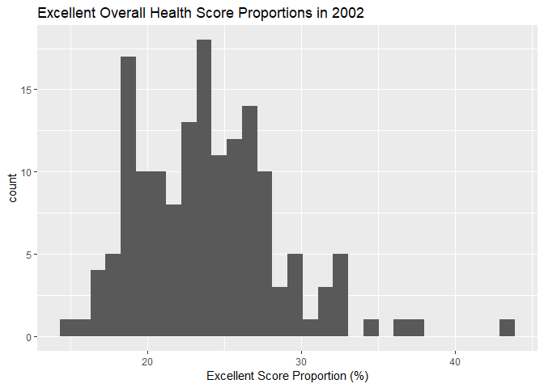
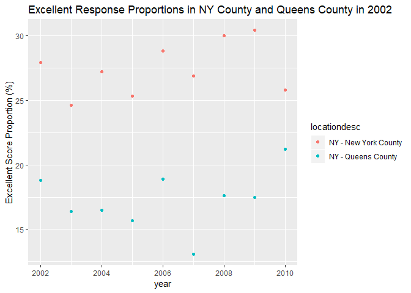

p8105\_hw2\_al3851.Rmd
================

``` r
library(tidyverse)
library(p8105.datasets)
library(cellranger)
library(readxl)
library(lubridate)
```

Problem 1
=========

Initial Cleaning
----------------

``` r
station_df = read_csv("./Data/NYC_Transit_Subway_Entrance_And_Exit_Data.csv") %>%
  janitor::clean_names() %>%
  select(line:entry, vending, ada) %>%
  mutate(vending = recode(vending, "YES" = TRUE, "NO" = FALSE)) %>%
  mutate(entry = recode(entry, "YES" = TRUE, "NO" = FALSE))
```

The data is still not tidy because the train line and route number are arranged in the wide format, since each route number is a variable name. However, after cleaning the names of the columns I selected only the needed columns, and within the mutate function, I used recode so that the "YES" "NO" charcter values of vending and entry would now be the logical TRUE FALSE. The data set has 1868 rows which represent each entrance or exit to every station in NYC and the dataset has 19 columns which are line, station\_name, station\_latitude, station\_longitude, route1, route2, route3, route4, route5, route6, route7, route8, route9, route10, route11, entrance\_type, entry, vending, ada.

ADA Compliance
--------------

I am using distinct with the parameter .keep\_all = TRUE to get a dataframe with just one row from each station. The number of rows will tell me the number of distinct stations. The sum of the ada variable divided by the number of rows will tell me te proportion that is compliant.

``` r
distinct_station_df = station_df %>%
  distinct(line, station_name, .keep_all = TRUE)

n_stations = nrow(distinct_station_df)

compliant_percent = (sum(distinct_station_df$ada) / n_stations)*10
```

There are 465 distinct stations and 1.8064516 percent of the stations are ADA compliant.

A Train
-------

I am making route number a variable by using the gather function. I don't need the entries in the route\_number column to start with route, so I am separating the entries at the end of the word route, and am deleting the column just consisting of the word "route". Then I am filtering for stations that have an A train route and am further filtering to choose only stations that are ada compliant.

``` r
distinct_a_df = distinct_station_df %>%
  gather(key = route_number, value = route_name, route1:route11) %>%
  separate(route_number, sep = "route", into = c("remove1", "route")) %>%
  select(-remove1) %>%
  filter(route_name == "A")

distinct_a_ada_df = distinct_a_df %>%
  filter(ada == TRUE)
```

60 stations serve the A train and 17 of these stations are ADA compliant

Problem 2
=========

Clean Mr. Trash
---------------

After reading in the data, I am using the round() function to round sports balls to the nearest integer and as.integer to convert the column to integer.

``` r
mr_trash_df = read_excel("./Data/HealthyHarborWaterWheelTotals2018-7-28.xlsx", 
                         skip = 1, 
                         sheet = 1, 
                         range = cell_cols("A:N")) %>% 
  janitor::clean_names() %>%
  filter(!is.na(dumpster)) %>%
  mutate(sports_balls = round(sports_balls, digits = 0)) %>%
  mutate(sports_balls = as.integer(sports_balls))
```

Read in Precipitation
---------------------

``` r
precipitation_2017_df = read_excel("./Data/HealthyHarborWaterWheelTotals2018-7-28.xlsx", 
                                   sheet = 4, 
                                   range = "A2:B10") %>%
  janitor::clean_names() %>%
  mutate(year = 2017)


precipitation_2016_df = read_excel("./Data/HealthyHarborWaterWheelTotals2018-7-28.xlsx",
                                   sheet = 5, 
                                   range = "A2:B14") %>%
  janitor::clean_names() %>%
  mutate( year = 2016)

precipitation_combined_df = bind_rows(precipitation_2017_df, precipitation_2016_df) %>%
  mutate(month = month.name[month])
```

Dataframe Summaries
-------------------

I am creating two dataframes to report the months with the highest rainfall for each year. I am also creating two different mr\_trash dataframes by filtering by year.

``` r
max_month_precip_2016_df = precipitation_combined_df %>%
  filter(year == 2016) %>%
  filter(total == max(total)) 


max_month_precip_2017_df = precipitation_combined_df %>%
  filter(year == 2017) %>%
  filter(total == max(total)) 


mr_trash_2016_df = mr_trash_df %>%
  filter(year == 2016)

mr_trash_2016_2017_df = mr_trash_df %>%
  filter(year == 2016 | year == 2017)
```

The unique identifyer in the precipitation dataset is month and year combined. The precipitation dataset provides data for 20 months in 2016 and 2017. The total rainfall in 2016 was 39.95 inches and the month with the maximum rainfall in 2016 was July with a total of 6.09 inches of rain. In 2017, the total amount of rain was 29.93 inches. The maximum rainfall occured in July with a total of 6.09 inches of rain.

The Mr Trash dataset provides data for 285 dumpsters and for each dumpster, provides data for 13 variables. The dataset provides data for the date the contents in the dumpster were emptied, a variable for the weight of the trash, a variable for the volume of the trash, 7 variables each representing the number of specific items, such as cigarette butts, found in the dumpster, and the number of homes the content in each dumpster powered. The median number of sports balls in a dumpster in 2016 was 26 balls. The mean weight of trash collected from 2016 to 2017 was 3.2021698 tons.

Problem 3
=========

I am changing "locationabbr" to "state" (including washington dc)because it seems more desriptive. Then I am filtering to only include overall health responses and am selecting columns by excluding columns. Then I am using the spread function to make the type of response (excellent, very good, good, fair, poor) their own columns.

``` r
brfss_df = brfss_smart2010 %>%
  janitor::clean_names() %>%
  rename(proportion = data_value, state = locationabbr) %>%
  filter(topic == "Overall Health") %>%
  select(-class, -topic, -question, -sample_size, -c(confidence_limit_low:geo_location)) %>%
  spread(key = response, value = proportion) %>%
  janitor::clean_names() %>%
  mutate(excellent_or_very_good = excellent + very_good)
```

Summary of Locations
--------------------

I am using the unique function to take out rows that have the same location and am doing the same to take out rows that have duplicate states.

``` r
distinct_locations = unique(brfss_df$locationdesc)

distinct_states = unique(brfss_df$state)
length(distinct_states)

most_observed_state_df = brfss_df %>%
  group_by(state) %>%
  summarise( n = n()) %>%
  filter(n == max(n))
```

There are 404 distinct locations and all the states are represented including Washington DC. The state with the most observations is NJ.

Excellent Score
---------------

I am filtering to just get rows where the year is 2002 to get the median of the proportion of excellent responses. Then I am making a histogram of the excellent proportions in 2002. Then I am further filtering to just get data for Queens County and NY County and am making a scatter plot of excellent proportions versus time.

``` r
brfss_excellent_2002 = brfss_df %>%
  filter(year == 2002) 
  
  
brfss_excellent_median = brfss_excellent_2002 %>%
  summarise(median(excellent, na.rm = TRUE))

ggplot(brfss_excellent_2002, aes(x = excellent)) + 
  geom_histogram() +
  labs(title = "Excellent Overall Health Score Proportions in 2002",
       x = "Excellent Score Proportion (%)")
```



``` r
brfss_df %>%
  filter(locationdesc %in% c("NY - New York County", "NY - Queens County")) %>%
  ggplot(aes(x = year, y = excellent, color = locationdesc)) + 
  geom_point() +
  labs(title = "Excellent Response Proportions in NY County and Queens County in 2002", 
       y = "Excellent Score Proportion (%)")
```



The median of the excellent responses in 2002 was 23.6
